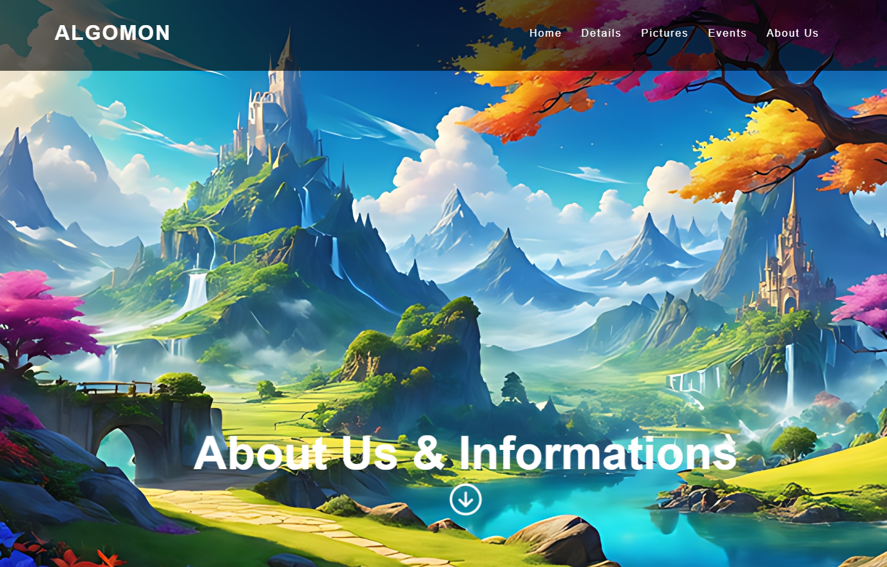

## Rhuan Mendanha

Computer Science student passionate about programming, UX/UI design, and continuous learning.  
I love creating interactive projects and exploring new technologies!

---

## 🌱 Currently Learning

- Advanced JavaScript & Node.js  
- OpenGL & Game Development with LWJGL  
- UX/UI best practices  

---

## 🚀 Featured Projects

### CriaFX Pro  
A Music Player with visualizer and EQ + youtube API. 
A UPGRADE from one of my projects called criafy.

### Blocks Prototype 
A simple 3D block built in Java using LWJGL 3.  
Starts with a cube directly in front of the camera so you can easily see it, with basic instructions displayed on the screen.  

### Algomon Game 
A college project using HTML & JS.  

---

## 📫 Connect with Me

- [Instagram](https://www.instagram.com/rhuanmendwest)  
- [Discord](https://discord.gg/AyZbePz2Qs)  
- [GitHub](https://github.com/Rhuan-Mendanha)
- [LinkedIn](https://www.linkedin.com/in/rhuan-mendanha-99b932384/)

---

> "Always learning, always growing." ✨

