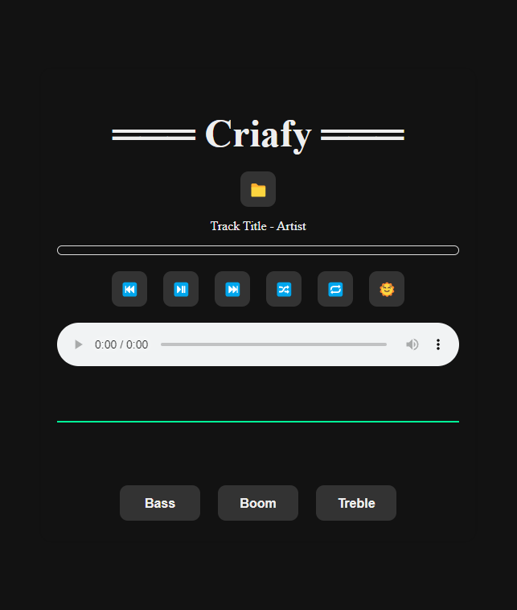

## Rhuan Mendanha

Computer Science student passionate about programming, UX/UI design, and continuous learning.  
I love creating interactive projects and exploring new technologies!

---

## 🌱 Currently Learning

- Advanced JavaScript & Node.js  
- OpenGL & Game Development with LWJGL  
- UX/UI best practices  

---

## 🚀 Featured Projects

### Blocks Prototype 
A simple 3D block built in Java using LWJGL 3.  
Starts with a cube directly in front of the camera so you can easily see it, with basic instructions displayed on the screen.  

### Music Player 
A simple music player built in JavaScript.  

### Discord AFK Bot 
A bot for managing AFK statuses in Discord.  

### Algomon Game 
A college project using HTML & JS.  

---

## 📫 Connect with Me

- [Instagram](https://www.instagram.com/rhuanmendwest)  
- [Discord](https://discord.gg/AyZbePz2Qs)  
- [GitHub](https://github.com/Rhuan-Mendanha)

---

> "Always learning, always growing." ✨

